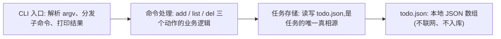
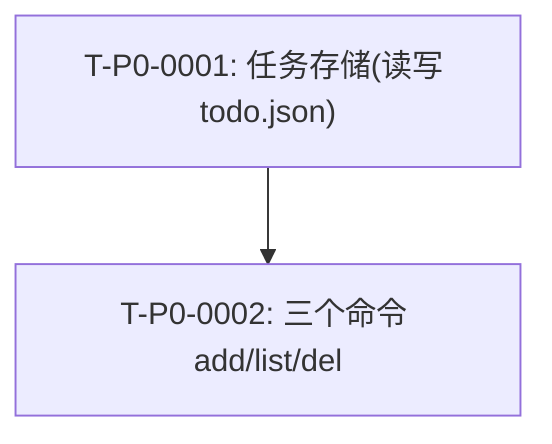

# 架构图

## 画图要求

- AI 必须把本项目真实的系统架构画进文档,每个部分标注职责。
- 要和总架构、总设计、接口契约对得上。

## 系统全景图



- **CLI 入口**:解析命令行参数,分发到对应命令,把结果打印给用户。不碰存储细节。
- **命令处理**:add(追加)、list(带编号列出)、del(按编号删)的逻辑。只通过任务存储读写。
- **任务存储**:封装对 `todo.json` 的读、写、损坏重建。**唯一**碰文件的地方。
- **todo.json**:运行目录下的本地文件,任务的唯一真相源;不允许换成数据库或远程。

## 任务依赖图



## 主线执行循环图

```mermaid
flowchart LR
  Truth["真相源: 用户原话 / 需求 / 禁止偏离"] --> Main["主线 AI: 照任务实现 + 跑验收"]
  Main --> Side["支线策略: 本例禁用"]
  Side --> Feedback["执行反馈日志 + 支线任务记录"]
  Feedback --> Check{"自检 + 定时审查: 对照真相源"}
  Check -->|一致| Commit["Git checkpoint"]
  Check -->|跑偏(如引入 db)| Stop["停止 + 偏离报告"]
  Stop --> Truth
  Commit --> Main
```
