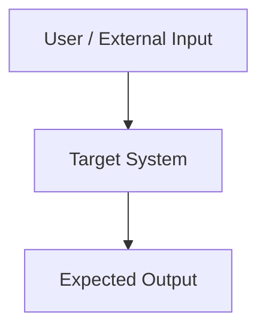
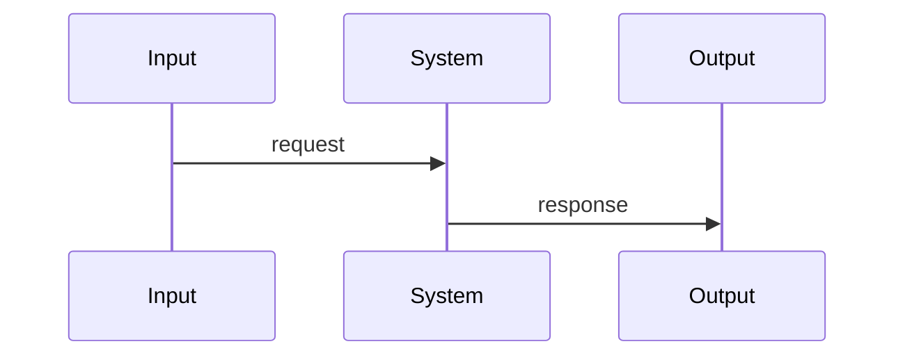

# 总架构文档

## 文档优先级

1. 用户原话文档
2. 接口契约文档
3. 总需求文档
4. 本总架构文档
5. 总设计文档
6. 任务文档

## 系统边界

### 本期要做

- 

### 本期不做

- 

### 不允许改动

- 

## 架构总览

## 核心组件

| 组件 | 职责 | 输入 | 输出 | 事实来源 | 禁止事项 |
|---|---|---|---|---|---|
| Component-1 | | | | | |

## 数据流

## 扩展点

| 扩展点 | 当前行为 | 未来扩展 | 不能破坏 |
|---|---|---|---|
| EXT-0001 | | | |

## 风险

| 风险 ID | 描述 | 影响 | 缓解 | 关联任务 |
|---|---|---|---|---|
| RISK-0001 | | | | |

