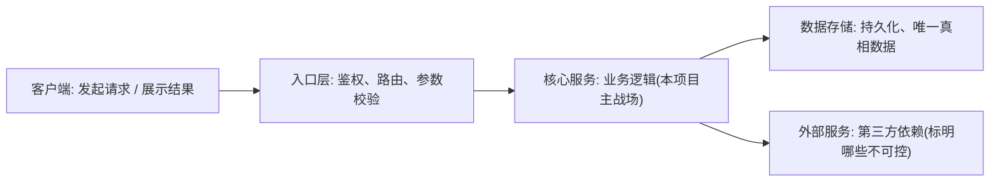
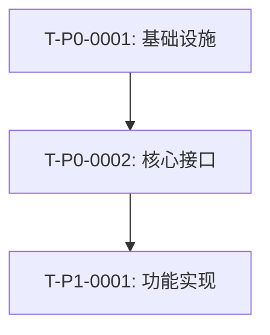
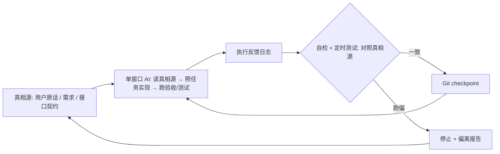

# 架构图

## 画图要求

- AI 必须把**本项目真实的系统架构**画进这份文档(Mermaid),让用户一眼看懂结构,不是放占位图。
- **每个部分都要标注职责**:这个模块/服务/层是干什么的、对谁负责、不负责什么。用户要看得见每一块在干嘛。
- 架构图要和 `总架构文档.md`、`总设计文档.md`、`接口契约文档.md` 对得上,不能各画各的。
- 改了架构就要同步更新图,图和文档不许脱节。

## 系统全景图

> 把下面替换成真实组件,节点文字写「名称:职责」。

## 任务依赖图

> 标出阶段与依赖,谁卡谁。

## 单窗口执行循环图

> 单窗口模式下,这一个 AI 怎么跑、怎么自检防跑偏。

