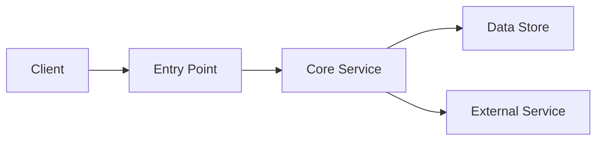
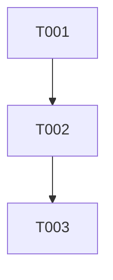

# 架构图

## 系统全景图

```mermaid
flowchart LR
  Client["Client"] --> Entry["Entry Point"]
  Entry --> Core["Core Service"]
  Core --> Store["Data Store"]
  Core --> External["External Service"]
```

## 任务依赖图

```mermaid
flowchart TD
  T001["T001"] --> T002["T002"]
  T002 --> T003["T003"]
```

## 代理协作图

```mermaid
flowchart LR
  User["User Words"] --> Claude["Claude: Requirements and Architecture"]
  Claude --> Reviewer["Reviewer-Claude: Document Review"]
  Reviewer --> Codex["Codex: Implementation"]
  Codex --> OpenCode["OpenCode: Technical Review"]
  OpenCode --> Status["Status and Handoff"]
```

