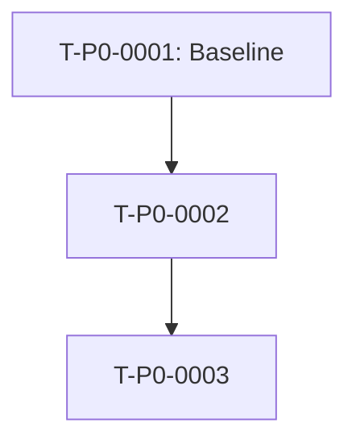

# 任务依赖图

## 依赖图

```mermaid
flowchart TD
  T0["T-P0-0001: Baseline"] --> T1["T-P0-0002"]
  T1 --> T2["T-P0-0003"]
```

## 依赖表

| 任务 ID | 依赖 | 阻塞原因 | 可并行 | 负责人 |
|---|---|---|---|---|
| T-P0-0001 | none | | yes | |

